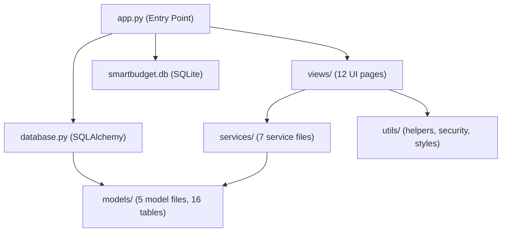

# 🇫🇯 SmartBudget AI — Household Financial Management Command Center

SmartBudget AI is a comprehensive, Streamlit-based household financial management application specifically tailored for the Fiji context. It enables families to transition from typical calendar budgeting to a **payday-to-payday tracking system**, incorporating local banking exports, AI financial coaching, collaboration, and debt payoff planning.

---

## 🚀 Key Features

*   **Payday-to-Payday Budgeting:** Track income and expenses aligned with your custom pay cycle (weekly, fortnightly, monthly).
*   **AI Financial Coach:** Get AI-driven advice, affordability calculators, spending anomaly detection, and a monthly financial review.
    *   *Note: Integrates with OpenAI (GPT-4o-mini) and has a built-in rule-based fallback system if no key is configured.*
*   **Fiji Bank Import:** Import CSV transaction statements directly from **ANZ, BSP, Westpac, HFC, BRED**, featuring automatic category mapping.
*   **Debt payoff Calculator:** Run interactive simulations comparing the **Snowball** and **Avalanche** methods for your household debts.
*   **Multi-User Collaboration:** Invite partners and family members with role-based access control (Owner, Partner, Viewer).
*   **Subscriptions & Sinking Funds:** Track recurring monthly subscriptions and build custom savings sinking funds with targeted deadlines.
*   **Calendar Integration:** Interactive calendar view highlighting upcoming bills, paydays, and subscription renewals.
*   **Premium Visuals:** Custom CSS styling with Google Fonts (Outfit), modern dark mode interface, glassmorphism card layouts, and micro-animations.

---

## 🛠️ Tech Stack & Architecture

- **Frontend:** [Streamlit](https://streamlit.io/) with custom stylesheet injections
- **Database:** SQLite with [SQLAlchemy ORM](https://www.sqlalchemy.org/)
- **Charts:** [Plotly Express / Graph Objects](https://plotly.com/python/)
- **Calendar:** `streamlit-calendar` (FullCalendar wrapper)



---

## 📦 Getting Started

### Prerequisites

- Python 3.10+
- A virtual environment (`venv/`) is already set up in the workspace.

### Setup and Running the Application

1. **Activate the Virtual Environment:**
   ```powershell
   .\venv\Scripts\activate
   ```

2. **Configure Environment Variables:**
   Create a `.env` file (based on `.env.example`) in the root directory:
   ```env
   DATABASE_URL=sqlite:///smartbudget.db
   OPENAI_API_KEY=your-api-key-here
   JWT_SECRET=your-jwt-secret-key
   ```

3. **Database Initialization & Seeding:**
   The repository includes a pre-seeded SQLite database `smartbudget.db`. If you need to re-seed or reset:
   ```powershell
   python seed.py
   ```

4. **Launch the Streamlit App:**
   ```powershell
   streamlit run app.py
   ```

---

## 🔑 Demo Credentials

To explore the application, you can log in using any of the pre-seeded accounts:

| Role | Email | Password | Description |
| :--- | :--- | :--- | :--- |
| **Admin** | `admin@smartbudget.local` | `AdminPass123!` | System administration |
| **Owner** | `owner@smartbudget.local` | `OwnerPass123!` | Full control over household |
| **Partner** | `partner@smartbudget.local` | `PartnerPass123!` | Edit rights, can log transactions |
| **Viewer** | `viewer@smartbudget.local` | `ViewerPass123!` | Read-only access to dashboard and views |

---

## 📂 Project Structure

- `app.py`: Core routing, layout, navigation, and page initialization.
- `database.py`: SQLAlchemy connection session management.
- `seed.py`: Pre-populates database with mock data.
- `models/`: Database schemas (e.g. `auth.py`, `finance.py`, `budget.py`, `household.py`, `audit.py`).
- `services/`: Core business logic (AI, imports, reporting, forecasting, etc.).
- `views/`: Streamlit page modules (Dashboard, ledger, onboarding, AI coach, calendar, etc.).
- `utils/`: UI styling wrappers, encryption/decryption utilities, and formatting helpers.
- `requirements.txt`: Python package dependencies.
